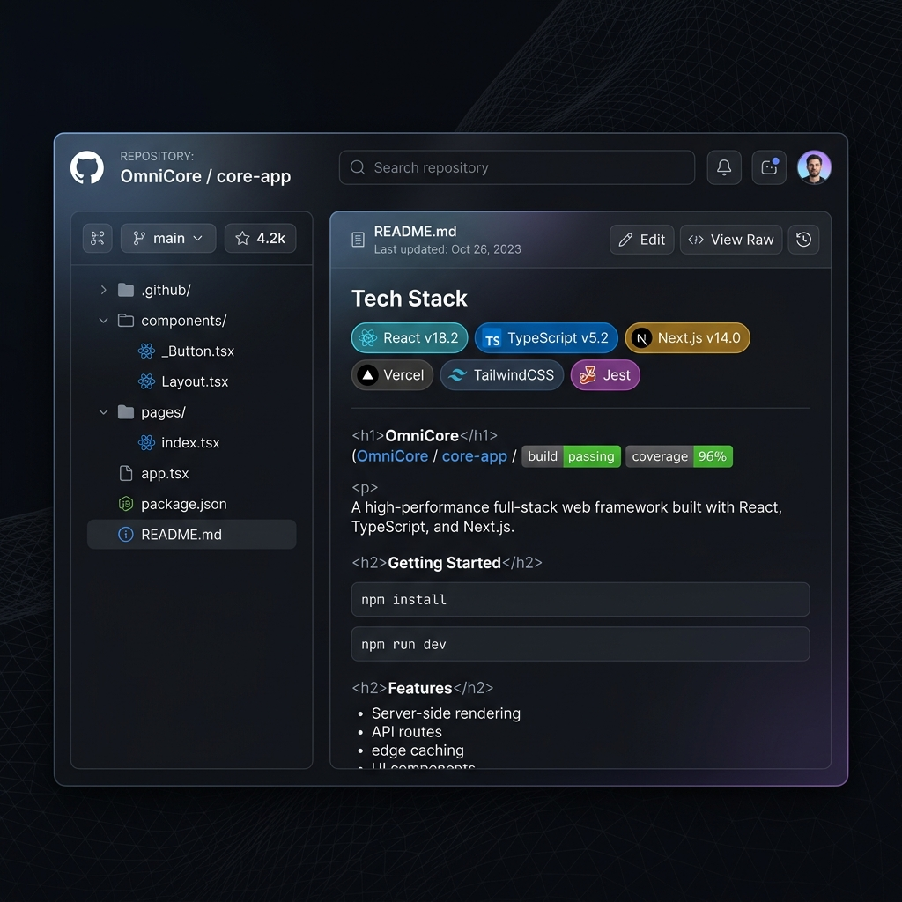

<div align="center">
  

  <h1>ghViewer</h1>
  <p>A faster, cleaner way to explore GitHub repositories.</p>

  [](https://nextjs.org)
  [](https://typescriptlang.org)
  [](LICENSE)

</div>

---

I built this because browsing GitHub feels like a chore sometimes. You click into a repo, you're staring at a wall of files, and you have no idea where to even start. Is this a React project? Does it use a database? Where's the config? You end up clicking around for 10 minutes just to understand a basic project structure.

**ghViewer** is my attempt to fix that. Open any public or private GitHub repo and you'll instantly see the README, the tech stack, the issues, PRs, commits — everything in one clean interface.

## What it does

- **Overview tab** — loads the README and auto-detects the tech stack (React, Next.js, Prisma, etc.) from package.json the moment you open a repo
- **Code explorer** — a proper file tree with syntax highlighting, a quick search bar, and branch switching. No more endless clicking
- **Issues & PRs** — see them all in one place, with full markdown rendering, avatar photos, label colors, and threaded comments that don't take over your whole screen
- **Commits** — clean timeline with author info and links back to GitHub
- **Dark mode** — because obviously

## Getting started

You'll need Node.js 18+ and a GitHub Personal Access Token (optional for public repos, required for private ones).

```bash
git clone https://github.com/nebioudaniel/ghViewer.git
cd ghViewer
npm install
npm run dev
```

Then open [http://localhost:3000](http://localhost:3000), paste in any GitHub repo URL, and you're in.

## GitHub Token

GitHub limits unauthenticated API requests to 60/hour. That sounds like a lot until you start clicking around and the app starts making 5–6 requests per tab you open.

To avoid hitting the limit, grab a token from [GitHub's developer settings](https://github.com/settings/tokens/new). For public repos, you don't need to check any scopes at all — just generate and paste. For private repos, check the `repo` scope.

The app has a built-in guide that walks you through it when you add a new project.

Your token is never sent anywhere except directly to `api.github.com`. It stays in your browser tab and disappears when you close the page.

## Stack

- [Next.js 16](https://nextjs.org) — app framework
- [React 19](https://react.dev) — UI
- [TypeScript](https://typescriptlang.org) — keeps things sane
- [Tailwind CSS 4](https://tailwindcss.com) — styling
- [Lucide](https://lucide.dev) — icons
- [react-syntax-highlighter](https://github.com/react-syntax-highlighter/react-syntax-highlighter) — code coloring
- [react-markdown](https://github.com/remarkjs/react-markdown) + [remark-gfm](https://github.com/remarkjs/remark-gfm) — markdown rendering

## Contributing

Pull requests are welcome. If you find a bug or have a feature idea, open an issue and let's talk about it.

## License

MIT
